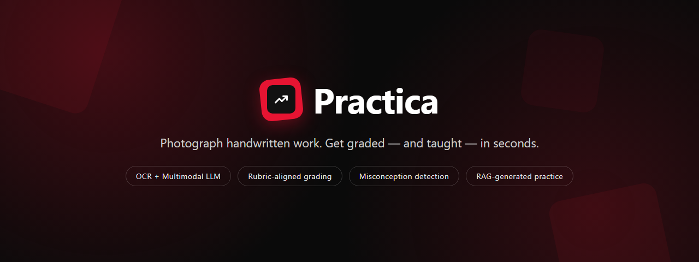
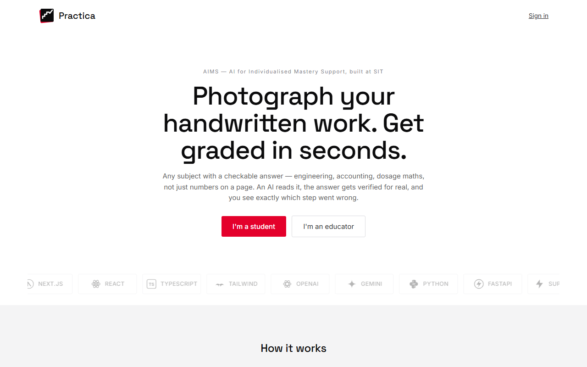

<p align="center">
  
</p>

<p align="center">
  <a href="https://practica-aims.vercel.app"></a>
  <a href="./LICENSE"></a>
  
  
  
  
  
</p>

<p align="center">
  <b>AI for Individualised Mastery Support (AIMS)</b> — an AI-assisted framework for scalable feedback<br/>
  and targeted practice in open-ended, handwritten assessments. Built at SIT.
</p>

<p align="center">
  
</p>

---

## The problem

Large-enrolment modules can't give timely, individual feedback on open-ended assessments — grading
1,680 handwritten scripts a term doesn't scale, so feedback collapses into a mark and a tick. Students
get a number, not a reason, and no way to find practice targeting their actual gap.

## What Practica does

A student photographs (or uploads a PDF of) their handwritten working. From there:

- 🔍 **OCR + line detection** (OpenCV) finds each line of work in the image
- 🧠 **A multimodal LLM transcribes it** — literally, errors and all, with a confidence score per step
- ✅ **The final answer is verified symbolically** (SymPy) wherever it's checkable — not just "looks right"
- 📋 **Graded against a real rubric**, with every mark citing the exact step that earned it
- 🎯 **Misconceptions are named**, not just marked wrong — "you exponentiated before applying the initial condition," not "incorrect"
- 📚 **Fresh practice problems are generated via RAG**, targeting that specific gap, verified correct before they're ever shown
- 👩‍🏫 **A human always signs off** — confident, verified results release automatically; anything uncertain waits for an educator, logged either way

Any subject with a checkable answer works — this isn't a math tool with a rubric bolted on. Engineering,
accounting, nursing dosage calculations, and plain-math problems all run through the identical pipeline;
only the rubric changes. Educators can create a new question end-to-end — paste the question, a model
solution, and rough rubric notes, and AI structures a weighted rubric from it.

## Try it live

**[practica-aims.vercel.app](https://practica-aims.vercel.app)**

- **Student** → enter one of the demo IDs (`111`, `222`, `333`) → straight into the submit screen
- **Educator** → one click → straight into the review queue

## Architecture

| Layer | Tech |
|---|---|
| App + API | Next.js 15 (App Router), TypeScript, Tailwind |
| Database, Auth, Storage | Supabase (Postgres + pgvector) |
| AI | OpenAI (vision, structured outputs) — provider-agnostic seam, swappable per role |
| Image processing + symbolic verification | Python sidecar (FastAPI, OpenCV, SymPy), deployed separately on Render |
| Retrieval-augmented practice generation | Local embeddings over an ingested course corpus |

Every model call is schema-validated (Zod), cached by input hash, and logged with token/cost/latency —
see [`docs/DECISIONS.md`](./docs/DECISIONS.md) for the full history of what changed and why, and
[`docs/STUBS.md`](./docs/STUBS.md) for what's intentionally not built yet.

## Local setup

```bash
git clone https://github.com/likalight/practica.git
cd practica
npm install
cp .env.example .env
```

1. Fill in `AIMS_OPENAI_API_KEY` and a real Supabase project's `NEXT_PUBLIC_SUPABASE_URL` /
   `NEXT_PUBLIC_SUPABASE_ANON_KEY` / `SUPABASE_SERVICE_ROLE_KEY`.
2. Run `supabase/migrations/*.sql` against that project, in order, via the Supabase SQL Editor — no
   CLI or DB password needed. Create a private Storage bucket named `submissions`.
3. `npm run seed` — seeds a demo module/question/rubric/taxonomy and two demo accounts.
4. `npm run ingest-corpus` — seeds the module's RAG corpus with real embeddings.
5. In a second terminal: `python -m venv sidecar/.venv`, activate it, `pip install -r sidecar/requirements.txt`,
   then `npm run sidecar:dev` — FastAPI on `localhost:8000`.
6. `npm run dev` — the app on `localhost:3000`.

### Fixture mode (no keys, no Supabase project)

Set `AIMS_FIXTURE_MODE=true` and `AIMS_AI_LIVE=false` to run entirely on a local JSON store and cached
AI responses — useful for offline development. `npm run seed-gold` then `npm run seed-ai-fixtures` seeds
a synthetic gold set into the cache for this mode.

## Evaluation

`npm run eval` runs the full pipeline against a gold set and prints the metrics table (score MAE/QWK vs.
human marks, misconception precision/recall, escalation rate, symbolic verification coverage) — see
`docs/PRD.md` §3.3 for target values.

## License

[MIT](./LICENSE)
